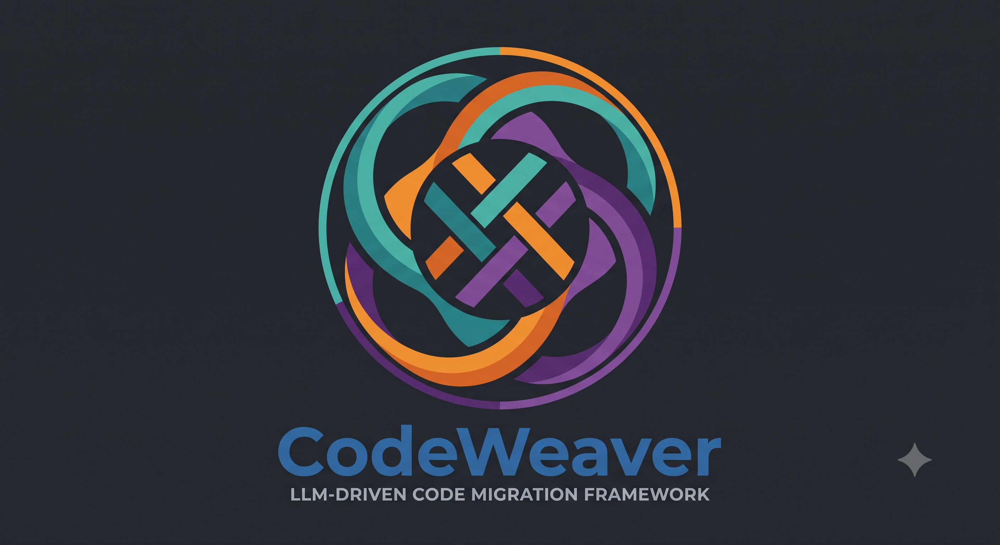

<p align="center">
  
</p>

<h1 align="center">CodeWeaver</h1>

**A general-purpose, [ReCodeAgent](https://arxiv.org/abs/2604.07341)-style
multi-agent framework for LLM-driven code translation and migration.**

CodeWeaver ports a codebase from one language to another with four cooperating
LLM agents — **Analyzer → Planner → Translator → Validator** — driven around a
milestone × repair loop until every slice passes its tests. The LLM work is done
by **GitHub Copilot CLI custom agents**; a small **Apache Burr** state machine is
the only deterministic code — it sequences the agents, owns the milestone × repair
loop, persists state (crash-resume), and renders a live telemetry UI. Burr never
calls an LLM.

It is the generalization of [`recodeAgent`](#6-relationship-to-recodeagent), which
hard-wired this pipeline to one project (translating the SONiC `xcvrd` daemon from
Python to Rust). CodeWeaver keeps the methodology and moves everything
project-specific into a **config file** — so the same engine drives *any*
translation: Python→Rust, Java→Go, COBOL→Java, JS→TS, and so on.

---

## 1. How it works

```
Apache Burr  (deterministic state machine + telemetry UI + SQLite resume)

  analyze ─▶ scope ─▶ plan ─▶ select_milestone ─▶ translate ─▶ validate ─▶ parity
               ▲                     ▲                 ▲            │           │
               │ parity found gaps   │ next milestone  │ repair     │           │ complete?
               │ (add milestones)    │ (passed & more) │ (failed &  ▼           │
               │                     └─────────────────┴  iter<max) ────────────┤
               └──────────────────────────────────────── incomplete ───────────┤
                                                              complete ─▶ terminal

        every action = one `copilot --agent NAME` subprocess
        GitHub Copilot CLI custom agents do ALL the real work
        (read / edit / shell / LSP / MCP / web)
```

| Stage | Agent | Reads → Writes |
|-------|-------|----------------|
| **analyze** | Analyzer | source → `analysis.md` (source research, dependency→target-lib analysis, target design + unit-test strategy) |
| **scope** *(milestone generator)* | Scoper | `analysis.md` / `parity.json` → `milestones.json` (a cumulative milestone matrix: skeleton → feature slices → golden; on a parity re-entry it appends milestones for the gaps) |
| **plan** | Planner | `analysis.md` → `plan.json` + a compilable skeleton (fragments, name mapping, mock/test seams, milestone plan) |
| **translate** | Translator | `plan.json` / `report.json` → the working copy (implements the milestone + its unit tests; repairs reported failures) |
| **validate** | Validator | runs unit tests + the end-to-end oracle → `report.json` (combined verdict; passes only if **both** layers pass) |
| **parity** *(verifier)* | Parity Verifier | compares the source with the final translation → `parity.json`; **complete → terminal**, **incomplete → back to scope** |

Inter-stage state is passed as **files** (`analysis.md`, `plan.json`,
`report.json`, `milestones.json`, `parity.json`) in the pipeline directory;
Copilot's `--output-format json` (JSONL) is parsed only for success/failure
detection and UI logging.

**Closing parity loop.** After every milestone passes, the **parity verifier** does
a comprehensive component-by-component comparison of the original repo against the
final translation. If anything is untranslated or only stubbed, it writes the gaps
to `parity.json` and the pipeline loops back to the **milestone generator**, which
schedules new milestones for exactly those gaps — then translates/validates them and
re-checks parity. **The run terminates successfully only when parity is verified
complete** (bounded by `max_parity_rounds`). Disable with `[execution].parity_check
= false`.

**Milestones can be auto-generated.** If your config declares no `[[milestones]]`,
the **scope** stage decomposes the port into a cumulative milestone matrix
(`milestones.json`) up front. Declare `[[milestones]]` yourself to seed the plan;
the parity loop can still extend it.

**Two validation layers** (faithful to the paper's Part B): fast **unit tests**
against mocked boundaries *plus* a fixed, authoritative **end-to-end oracle** that
is never translated or modified. **Milestones are cumulative**: a milestone must
pass its own tests *and* every earlier milestone's (regression safety).


---

## 2. Install

```bash
pip install -e .                 # core (Apache Burr)
pip install -e ".[ui]"           # + Burr telemetry UI
pip install -e ".[yaml]"         # + YAML config support (TOML/JSON need nothing)
```

Requires **Python 3.11+** (stdlib `tomllib`) and the **GitHub Copilot CLI**
(`copilot`) on `PATH`, authenticated (`COPILOT_GITHUB_TOKEN` / `GH_TOKEN` /
`GITHUB_TOKEN`). Install the agent profiles once:

```bash
codeweaver install-agents        # mirrors agents/*.agent.md to ~/.copilot/agents
```

(`codeweaver run` also installs them automatically before each run.)

---

## 3. Quick start

```bash
# 1. Scaffold a project config
codeweaver init my-port && cd my-port
$EDITOR codeweaver.toml          # fill in the brief, paths, commands, milestones

# 2. Smoke-test the orchestrator OFFLINE (mock agents, no Copilot, no cost)
codeweaver check --config codeweaver.toml

# 3. Inspect the milestone matrix + resolved cumulative gates
codeweaver milestones --config codeweaver.toml

# 4. Run for real
codeweaver run --config codeweaver.toml --app-id port-001 --max-iter 5

# Resume a crashed run: re-run with the SAME --app-id (SQLite persister continues)
codeweaver run --config codeweaver.toml --app-id port-001

# Telemetry UI (project = your config's slug)
burr
```

`codeweaver check` exercises the four behaviors offline against the mock agent:
**happy path**, **repair loop**, **budget exhaustion**, and cross-process
**crash-resume** — no Copilot required.

---

## 4. Configuring a project

A run is fully described by one `codeweaver.toml` (JSON and YAML also work). The
project-specific knowledge that `recodeAgent` baked into its agent prompts now
lives in `[translation].brief` + a handful of config values; the four agent
profiles stay generic.

```toml
[project]
name = "my-port"
slug = "my-port"
description = "Translate <what> from Python to Rust."

[translation]
source_language = "Python"
target_language = "Rust"
brief = """
The architectural constraints, provided scaffolding NOT to reinvent, the
observable contract the port must reproduce, and any files that must never change.
"""

[paths]
source_dir = "source"              # what to translate
reference_dirs = ["../e2e-tests"]  # extra read-only --add-dir grants (the oracle)
# immutable_input = "crate"        # optional: copied to working_copy, never edited
# working_copy = "pipeline/crate"  # optional: the mutable copy agents translate into
pipeline_dir = "pipeline"          # runtime hand-off + artifacts + logs

[commands]                          # shell commands the agents run
build_check = "bash tools/build_check.sh"
unit_test  = "bash tools/unit_test.sh"
validate   = "bash tools/validate.sh {milestone}"

[validation]
gate_template = '-k "{tests_or}"'  # cumulative tests -> the validate gate string

[model]
default = "claude-opus-4.8"
effort_default = "high"
[model.effort]
analyzer = "max"
planner = "max"
translator = "max"
validator = "high"

[execution]
max_iter = 5
parity_check = true        # final source↔translation parity loop (default true)
max_parity_rounds = 3      # bound on parity re-scope iterations

[[milestones]]
id = "M0"
title = "Skeleton"
goal = "Compiles + runs; no features yet."
tests = []

[[milestones]]
id = "M1"
title = "First feature"
goal = "Implement the first slice of behavior."
tests = ["test_first"]
```

See [`docs/config.md`](docs/config.md) for the full reference and
[`docs/architecture.md`](docs/architecture.md) for the design. Full worked
examples live in [`examples/`](examples/):

- **`examples/minimal/`** — a tiny Python→Rust library port (drives `codeweaver check`).
- **`examples/auto-milestones/`** — same, but with **no `[[milestones]]`** — the
  scope stage generates them (offline, the mock scoper emits `M0..M2`).
- **`examples/crust-bench/`** — run CodeWeaver on a [CRUST-Bench](https://arxiv.org/abs/2504.15254)
  **C → safe-Rust** transpilation task (retargetable to any of the 100 benchmark
  projects via `setup`; auto-milestones + parity; validated by `cargo test`).
- **`examples/commons-validator/`** — translate [Apache Commons Validator](https://github.com/apache/commons-validator)'s
  `routines` package (validators + check-digit algorithms) from **Java → idiomatic
  Python** (auto-milestones + parity; validated by translated `unittest` tests).
- **`examples/xcvrd/`** — reproduces the original `recodeAgent` use case (SONiC
  xcvrd Python→Rust, thick PyO3 HAL + `swss-common`, DUT black-box oracle) purely
  as a config + [`brief.md`](examples/xcvrd/brief.md).

---

## 5. Repository layout

```
CodeWeaver/
├── codeweaver/               # the framework (project-agnostic)
│   ├── config.py             #   load/validate the project config -> Config
│   ├── milestones.py         #   cumulative test gates from the config matrix
│   ├── prompts.py            #   default stage prompt templates (+ overrides)
│   ├── copilot.py            #   invoke_agent(): subprocess wrapper around `copilot`
│   ├── state.py              #   typed Burr state helpers
│   ├── actions.py            #   @action: analyze/plan/select_milestone/translate/validate
│   ├── app.py                #   ApplicationBuilder: actions + transitions + persister
│   ├── mock.py               #   offline mock agent (drives the graph without Copilot)
│   └── cli.py                #   `codeweaver` CLI (run/check/milestones/install-agents/init)
├── agents/                   # generic Copilot CLI custom-agent profiles (6 roles: scoper + parity + the 4 core)
├── tools/                    # install_agents.sh, check.sh
├── examples/                 # minimal/ and xcvrd/ project configs
└── docs/                     # config.md, architecture.md
```

Your **project's** build/validate scripts (referenced by `[commands]`) live in
*your* repo, not here — CodeWeaver just invokes them.

---

## 6. Relationship to recodeAgent

`recodeAgent` proved this pipeline end-to-end on a hard target (translating a live
SONiC daemon, black-box validated on real hardware). CodeWeaver extracts its
reusable core:

| recodeAgent (hard-coded) | CodeWeaver (generalized) |
|--------------------------|--------------------------|
| `orchestrator/` tied to xcvrd paths/prompts | `codeweaver/` driven by a `Config` |
| `milestones.py` = fixed M0–M6 pytest matrix | `[[milestones]]` in config + `gate_template` |
| xcvrd-specific `agents/*.agent.md` | generic role profiles; specifics in `brief` |
| `RECODE_*` env vars | `CODEWEAVER_*` env vars |
| xcvrd DUT `tools/` | your project's `[commands]` scripts |

The deterministic core (Burr graph, milestone × repair loop, crash-resume,
two-layer validation, file-based hand-off) is unchanged.

---

## 7. License

MIT — see [`LICENSE`](LICENSE).
